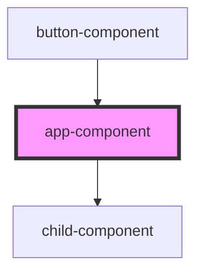

# app-component

<!-- Auto Generated Below -->

## Dependencies

### Used by

 - [button-component](../button-component)

### Depends on

- [child-component](child-component)

### Graph

----------------------------------------------

*Built with [StencilJS](https://stenciljs.com/)*
